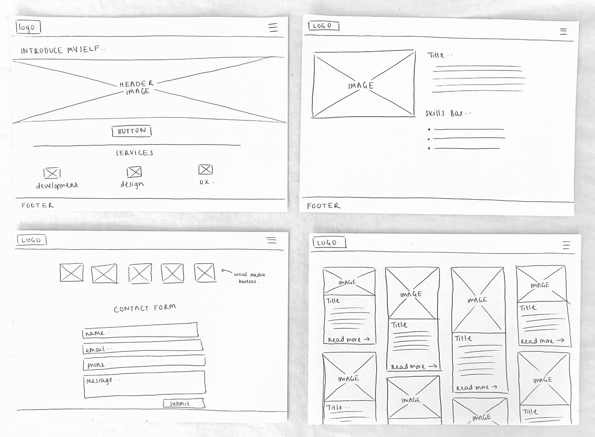
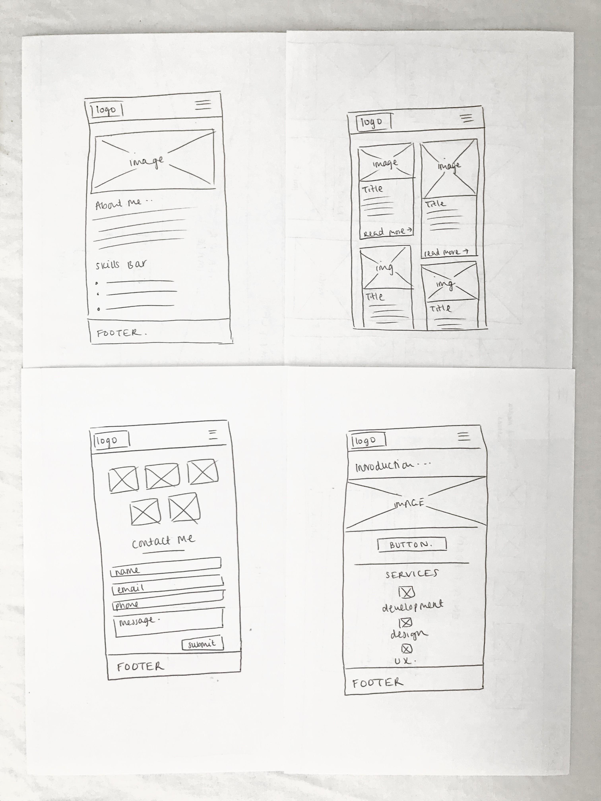
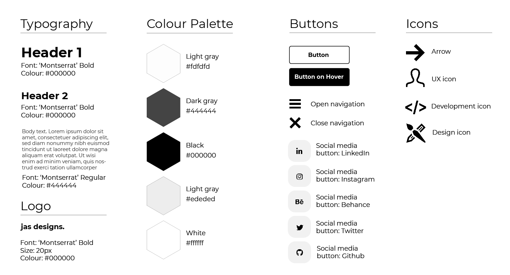

# A Responsive Portfolio Website

Github: https://github.com/jasharwood/CDA404-AE1

## Contents

1. Background 
1. Wire Frames
1. Colour Choices
1. Accessibility
1. GDPR
1. Distance Selling
1. Evaluation

## 1. Background

The aim of this project was to create a responsive website which attempts to solve a problem.
The website that was created was a portfolio which aimed to solve self promotion problems.
A portfolio is very important for a designer and/or developer to have because it showcases their best work 
and therefore demonstrates their skills and abilities. For a university student studying web design and development,
it's important to be able to market creative talent to potential employers. A strong portfolio could be essential
in securing a placement or permanent job with a potential employer. Each page was created using HTML and styled with css. Javascript was used to
create the navigation menu. 

## 2. Wire Frames

Before the development stage, low fidelity wire frames (sketches) for each of the 4 pages were created. These pages included; the homepage, about me page, portfolio page and a contact me page.
Wireframes for both the desktop and mobile versions were created.

These wireframes will aid in the development of the website because they provide a rough idea of sizing and placement
of each element on the page. This will make the entire development process clearer and a greater understanding is obtained
about what exactly is being built.

## 3. Colour Choices

A visual style guide including typography, colour palette, buttons and icons was created to ensure the theme of the website was consistent throughout. 

The overall theme chosen for this project was a minimalistic and/or modern one because it is simple, visually pleasing and only uses essential elements.
A limited colour palette was used which consisted of black, white and grey to ensure the site was aesthetically pleasing.
The font family 'Montserrat' was chosen as this is a sans-serif font. Sans-serif fonts are more modern and convey simplicity.
The buttons and icons used were as minimalistic as possible and adhered to the simple colour palette.

## 4. Accessibility

It was important to ensure the portfolio site was accessible so it can be used by a range of people,
including those with disabilities and impairments. The W3C has set some accessibility standards that websites should follow. 
For this project, alternative text was provided for every image using the "alt" tag. 
This means that those with visual impairments or those that use screen readers can still access the information and
have the alternative text read aloud to describe the image. It was made sure that the alternative text for each image was
detailed, specific and had clear context.

## 5. GDPR

It was also important to ensure the portfolio site followed General Data Protection Regulations (GDPR). For this project,
a link to a basic privacy policy was put in the footer, which was made available on every page. This privacy
policy included defintions, key principles and the 8 individual rights. This was done to ensure every person that
visits the website was made aware of their rights under the GDPR. The privacy policy was also necessary because there
is a contact form on the website which collects personal information such as a name, email and phone number.

## 6. Distance Selling

The online and distance selling act states that you must provide certain information if you're selling goods or services.
As this website is a portfolio, there are no goods or services being sold therefore no measures were taken.

## 7. Evaluation

This project consisted of designing (drawing wireframes) and developing a responsive website which aimed to solve a problem.
A portfolio site was created which included a homepage, about me page, contact page and a portfolio page. The
site successfully showcases work that has been done in and outside of university. It aims to explain the services that are
offered, describe more about myself and allows people to get into contact via a form. The website itself hopefully
demonstrates the html, css and basic javascript skills that have been obtained during the first year of university. The
problem of self promotion has been met because potential employers can now view the site and the work that has been exhibited.

### 7.1 Problems

A few problems were encountered during this project. The first major problem was the use of the "mega menu". Some page content was
displaying on top of the menu when it was opened. However, after some research, the z-index property was discovered
and this problem was fixed. A few problems were experienced when making the site responsive. A few elements used a position
of "absolute" so when the screen size was changed, the elements were all over the place. To fix this, a majority of the
elements were given a position of "relative" instead. Various other changes had to be made to ensure the site was
responsive such as displaying elements in one column, reducing text size and altering margins and padding.
All html and css was checked with the W3C Markup Validation Service. Minor problems with code were found however most of these
were fixed.

### 7.2 Testing and The Development Process

The website was tested on both desktop and mobile screens by using development tools such as responsive design mode on the browser. 
From using this tool, it was discovered that content needed to be displayed in single columns, some font sizes needed to be reduced and 
margins and/or padding had to be altered. 
A desktop first approach was used during the development process because the aim was to make a creative portfolio which demonstrated my skills and
abilities. Therefore, it was important to design for the highest screen size first. It was enough just to make sure the mobile version was functional.
The overall process that was used whilst developing the portfolio site included writing the code with a live preview of the site
in easy view. The HTML for each element was added first, followed by styling with css and javascript. Due to the live preview, each change
could be seen straight away which made it easy to spot any problems. The javascript was included in the html documents because only
a minimal amount was used. Finally, after various milestones were reached (such as creating a page or a difficult area) the work was
pushed to github making it easy to roll back on previous versions if necessary. 

### 7.3 Design Decisions

The design decisions were based on personal preference - minimalist, a limitied colour palette and plenty of white space. 
A theme of minimalism was chosen as this is one of the more modern design trends. 
Inspiration was also drawn from various designs on Behance in terms of how the website should be laid out. 
Feedback was collected frequently whilst developing the project to determine which styles or effects were preferred. 
Having different opinions made it easier to make effective design choices. 

### 7.4 Conclusion and Improvements 

To conclude, this project used informed design choices, a consistent development process and it was made accessible whilst adhering to the GDPR.
Minor problems were encountered which were quickly fixed and the original aims of the project were met.

To further improve this project, the site could be made more accessible. For example, the website should be fully functional by using just the keyboard
as some people cannot use a mouse. There may also be some issues surrounding the colour choices on the site
because some people may find it hard to read text that doesn't have much contrast.
Also, the contact form could be improved by making it fully functional and also including an "opt in". 
The social media buttons are not yet linked to anything and a lot of placeholder text was used therefore these things would need to be changed
if the site was to go live. Finally, the portfolio page takes a while to load so it would be preferred to use images of a smaller size to speed things up.